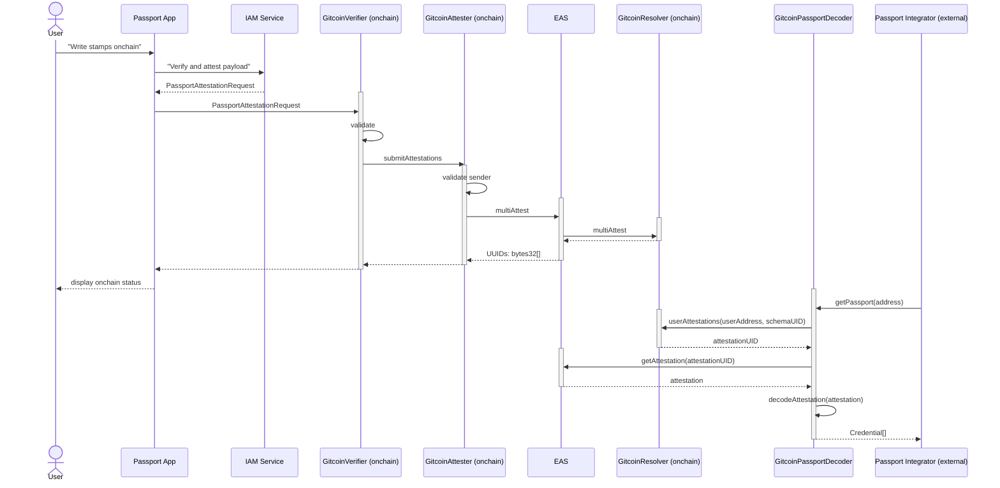

# Bringing Passport Data Onchain

In order to store Passport (and potentially Passport scorer data) onchain we
have chosen the [Ethereum Attestation Service](https://attest.sh/) (EAS). Stamps
(and in the future potentially also scores and other data) will be written as
attestations onchain, using the EAS protocol.

EAS is a protocol that allows storing attestations on chain.

How does this work?

1. You define a schema for your attestation. Each schema is identified by a
   unique UUID.
2. Once the schema was created, you can write data to it by calling one of the
   EAS smart contracts functions, for example
   `attest(AttestationRequest calldata request)`
   (see [IEAS.sol](https://github.com/ethereum-attestation-service/eas-contracts/blob/master/contracts/IEAS.sol#L148-L169))
3. The following data will be registered in the attestation:
   1. the attester (this will be the`msg.sender`)
   2. the recipient (an ETH address)
   3. other data like: creation date, expiration, is \_revocable, a referenced attestation

The Passport concept for bringing data onchain contains the following:

- GitcoinAttester - this is a smart contract that is designed to act as a proxy.
  Its purpose is to relay any potential attestations, coming from trusted resources,
  to the EAS smart contract so that it is registered as the attester.
- GitcoinVerifier - this is designed to be a trusted resource for the Attester. This
  smart contract will be called from the
  [Passport App](https://passport.gitcoin.co/) whenever a user desires to bring
  their stamps onchain.
- Resolver - this is an optional smart contract that can be registered for an EAS
  schema. We will use a resolver smart contract to record the latest state of a
  user's Passport related attestations.

For the moment there is only 1 GitcoinVerifier smart contracts available (and
only 1 will be deployed), but it is possible that in the future more verifier
smart contracts will be created, and added to the allowlist in GitcoinAttester.

All three smart contracts implement access control, by extending from
OpenZeppelin's `Ownable`.

All of the smart contracts are upgradeable and pauseable.

The flow:



## GitcoinAttester

Here are the main features:

- the attester is an ownable smart contract
- It implements a function that will forward attestation data to the EAS smart
  contract: `function submitAttestations(MultiAttestationRequest[] calldata multiAttestationRequest)`
- only registered verifiers are allowed to call the `submitAttestations` function
- the registration list can be managed using the following function (both of
  which can only be invoked by the owner):
  - `function addVerifier(address _verifier)` - add a new verifier
  - `function removeVerifier(address _verifier)` - remove an existing verifier
- allows settings the address of the EAS smart contract to which data will be
  forwarded (this function is also only invocable by the owner):
  `function setEASAddress(address _easContractAddress)`

## GitcoinVerifier

The purpose of the verifier is to validate the Passport data that a user wants
to bring onchain. The validation is performed by checking the
[EIP-712](https://eips.ethereum.org/EIPS/eip-712) signature for the data that is
sent in by the Passport app.
The EIP-712 signature will be created by the **Passport IAM Service** which is
the same service that issues the stamps (verifiable credentials) for the Passport
applications.

The flow when the user triggers the process to bring their data onchain from the
Passport app is the following:

1. The Passport App creates a payload with the data to be written onchain (a
   list of stamps) and sends this to the IAM Service
2. The IAM service validates that data and signs it with the EIP-712 procedure
3. The Passport App will call the `GitcoinVerifier` function `verifyAndAttest`
4. The signature of the data will be validated, and validation passes the
   `function submitAttestations(MultiAttestationRequest[] calldata multiAttestationRequest)`
   and the `GitcoinAttester` will be called to write the data to the EAS protocol

### Fee

It was a requirement that a small fee shall be collected by the verifier for
each data set that is written onchain. For this purpose when the
`verifyAndAttest` method is called, it will check if the expected amount
(in ETH) has been sent to the smart contract, and will revert with the message
“_Insufficient fee_” if this is not the case.

The amount of the fee is determined by the IAM server, and it is the equivalent
of 2 USD in ETH.
The fee is part of the data structure that is signed with the EIP-712 procedure,
so that it cannot be changed during the process of writing stamps onchain.

### Replay protection

In order to prevent against replay attacks, the `Passport` structure that is
passed in the `verifyAndAttest` function call, also must contain a `nonce`.

This nonce is unique per recipient. The nonce will start from 0, and it will be
incremented by 1 for each call that is made to the `verifyAndAttest` function
for the specified recipient.

The `Passport` structure must contain the correct (the next) nonce for the
recipient, in order for the call to `verifyAndAttest` to get through. It will be
reverted otherwise.

## GitcoinResolver

You can find the implementation of the GitcoinResolver _[here](../contracts/GitcoinResolver.sol)_

EAS provides a mechanism to perform additional validations for stamps and
implement additional smart contract functionality related to attestations using
[resolver contracts](https://docs.attest.sh/docs/tutorials/resolver-contracts).
For our use-case we will use resolver contracts for the following purposes:

- to track which attestations a given recipient owns (this information is not
  provided by the EAS smart contract by default)
- caching the latest score that a user has, in order to provide more efficient
  access to a users score (cheaper in terms of gas costs)

### Tracking attestations

The attestations are stored in a mapping that allows storing attestations
from any schema:

```solidity
mapping(address => mapping(bytes32 => bytes32)) public userAttestations;
```

The meaning of this nested mapping is the following:

```txt
user ETH address => schema UID => attestation UID
```

In order to ensure the integrity of the data that a resolver stores, resolver
smart contract shall only validate and store data from trusted sources:

- a trusted EAS contract
- a trusted Attester

### Caching users scores

In order to provide faster access to a users score, the information from score
attestations is cached in an attribute of the `GitcoinResolver` smart contract:

```sol
  // Mapping of addresses to scores
  mapping(address => CachedScore) private scores;
```

where `CachedScore` is defined as follows:

```sol
struct CachedScore {
  uint32 score;
  uint64 issuanceDate;
  uint64 expirationDate;
}
```

Retrieving the latest score for a user becomes much cheaper in terms of gas costs
and easier using the helper function:

```sol
function getCachedScore(
  address user
) external view returns (CachedScore memory);
```

NOTE: the `getCachedScore` function and `struct CachedScore` will convert the `score` attribute to a value that is offset by 4 decimals regardless of what value is set as `Score_decimals` within the attestation. This is done for more cost efficient storage and retrieval. If integrating with the `GitcoinResolver` be sure to adjust the value accordingly.

## GitcoinPassportDecoder

This is a convenience smart contract that can be used by any party to check for
the on-chain passport attestation for a given ETH address.
See the documentation [How to Decode Passport Attestations
](./05-querying-passport-attestations-onchain.md) for more details.

_[← Back to README](..#other-topics)_
