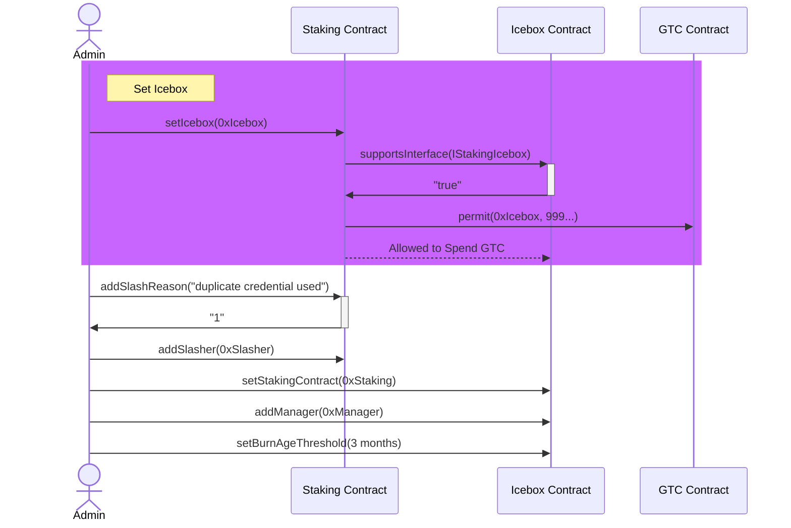
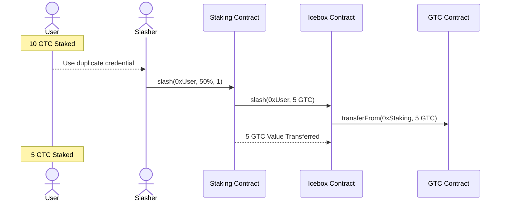
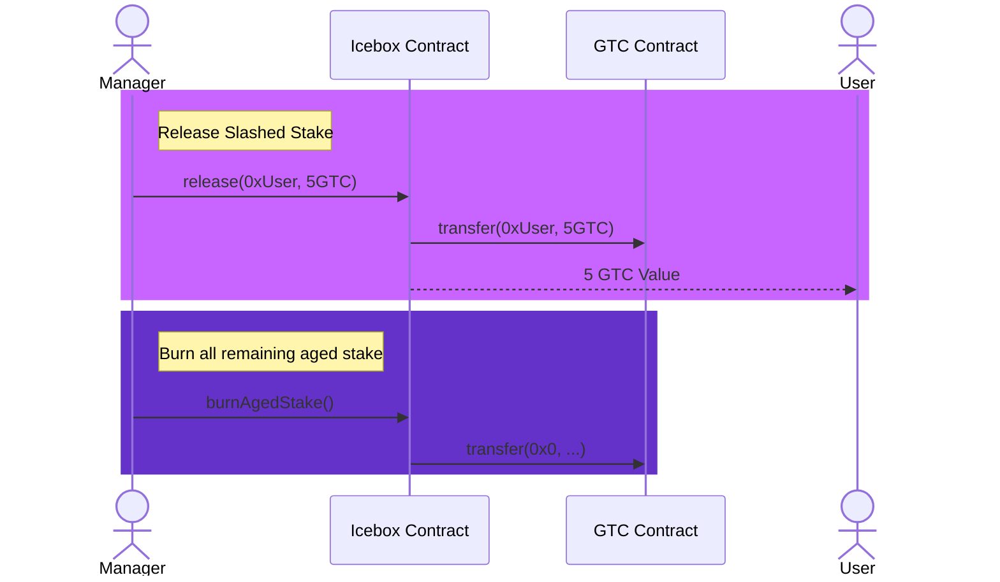

# Identity Slashing

This describes the contracts and entities involved in slashing staked GTC.

## Overview

To simplify diagrams, the following fake addresses are used:

- User: 0xUser
- Staking Contract: 0xStaking
- Icebox Contract: 0xIcebox
- Icebox Manager: 0xManager
- Slasher: 0xSlasher

### Setup

### Slashing

### Releasing and Burning

## Staking Contract

Tracks stake and a list of approved **Slashers** who can slash stake.
When slashed, stake is sent to the **Stake Icebox** contract.

The latest-to-unlock stake will be slashed first.

See [section #8](./08-gitcoin-identity-staking-management.md) for more info about this contract, not
related to slashing.

### Slashing Roles

- `Admin` - manage roles, upgrade contract
- `Slasher` - can slash stake

### Slashing Methods

- `addSlasher(address slasher) onlyAdmin`
- `removeSlasher(address slasher) onlyAdmin`
- `slash(address user, uint16 percent, uint16 reason) onlySlasher` - slash
  given % of a user's stake, send it to the Icebox
- `slashMultiple(address[] users, uint16 percent, uint16 reason) onlySlasher`
- `addSlashReason(string reason) onlyAdmin => uint16` - add a reason, returns
  the index
- `setIcebox(address iceboxAddress)` - check that the correct contract address
  is used with ERC165. Permit max spending of GTC for the icebox. If a previous
  icebox was defined, un-approve that contract's spending.

### Slashing State

- `mapping(uint16 => string) public slashReasons`
- `uint16 slashReasonCount`
- `IGitcoinStakingIcebox public icebox`

## Slasher(s)

Can call `slash` to slash stake. Could be...

- An offchain script
- Manual slashing
- A slashing contract

Initially, all slashing will be based on duplicate credentials. A script
will run periodically to detect duplicate usage and issue a transaction to
slash transgressors. The script's wallet will be initiating the transaction
as part of a multisig Safe wallet, and at least one other approval will be
required to execute the transaction.

Later, the plan is to add contracts which can verify proofs of transgressions
onchain and slash accordingly.

## Stake Icebox Contract

Repository for slashed funds. This will track the slashed amounts for each user
and the dates that they are slashed. There will be an approved list of manager
addresses which can either return stake to the original user or burn all stake
that is older than a set threshold.

### Roles

- `Admin` - manage roles, upgrade contract, set age threshold
- `Manager` - can release and burn stake

### Methods

- `addManager(address manager) onlyAdmin`
- `removeManager(address manager) onlyAdmin`
- `setBurnAgeThreshold(uint64 ageThreshold) onlyAdmin`
- `setStakingContract(address stakingContract) onlyAdmin`
- `release(address user, uint256 amount) onlyManager`
- `burnAgedStake() onlyManager`
- `supportsInterface(...)` - implement ERC165 interface for IGitcoinStakingIcebox
- `slash(address user, uint256 amount) onlyStakingContract` - call transferFrom
  and record the slash

### State

- `mapping(user => Slash) public slashes`
- `struct Slash { uint256 amount, uint64 slashedDate }`
- `uint64 public burnAgeThreshold`
- `IGitcoinIdentityStaking public stakingContract`

_[← Back to README](..#other-topics)_
